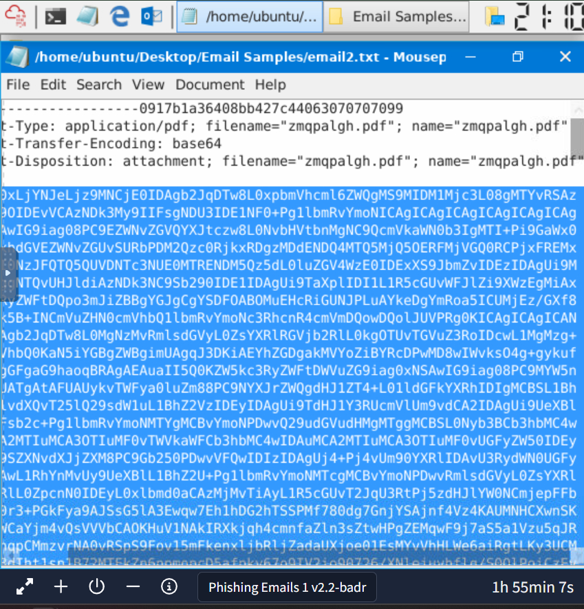
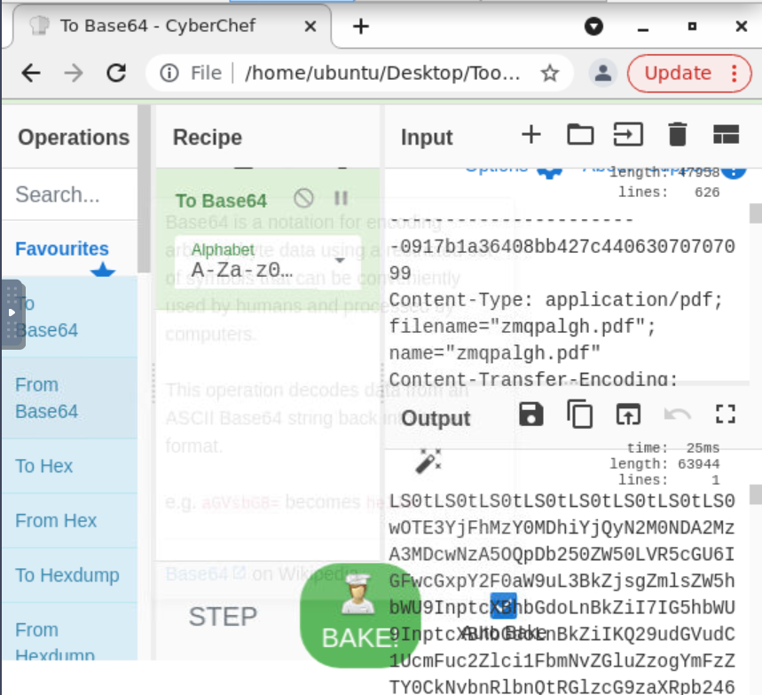
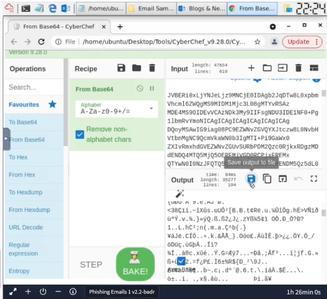
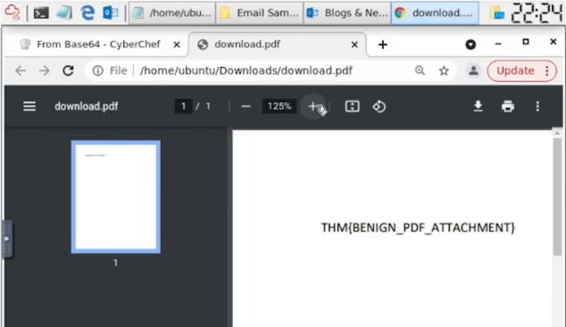

# Base64 PDF Reconstruction Using CyberChef

## Objective
Reconstruct a PDF attachment embedded as Base64 data within a raw email file (`email2.txt`) and identify the text contained in the recovered document.

## Scenario
A raw email file was provided for analysis. Within the message body, an embedded attachment was identified as Base64-encoded data.

The objective was to:
- Identify the encoded attachment
- Extract the Base64 content
- Decode the data
- Reconstruct the original PDF file
- Recover and document the text inside the PDF

## Tools Used
- Text editor
- CyberChef
- PDF viewer

## Methodology

### 1. Identify encoded data
The `email2.txt` file was reviewed manually. A block of Base64-encoded content was located within the email body.

### 2. Extract Base64 content
The full Base64 block was isolated and copied to ensure only encoded data was processed.

### 3. Decode using CyberChef
The Base64 content was pasted into CyberChef.

Recipe applied: **From Base64**

CyberChef successfully decoded the content into binary format, identifying it as a PDF file.

### 4. Reconstruct the PDF
The decoded output was downloaded as `recovered.pdf` and opened in a PDF viewer to confirm file integrity.

### 5. Extract document content
The reconstructed PDF was reviewed to identify its contents.

**Recovered text:** see the screenshot above.

## Results
- Successfully identified embedded Base64 attachment
- Decoded and reconstructed original PDF file
- Extracted and documented document contents
- Verified file integrity after reconstruction

## Key Takeaways
- Email attachments may be embedded using Base64 encoding
- Encoded artifacts can be manually extracted and reconstructed
- CyberChef provides reliable decoding for forensic workflows
- Proper documentation improves reproducibility and clarity in investigations

## Skills Demonstrated
- Email artifact analysis
- Base64 decoding
- File reconstruction
- Tool-based forensic workflow
- Technical documentation
