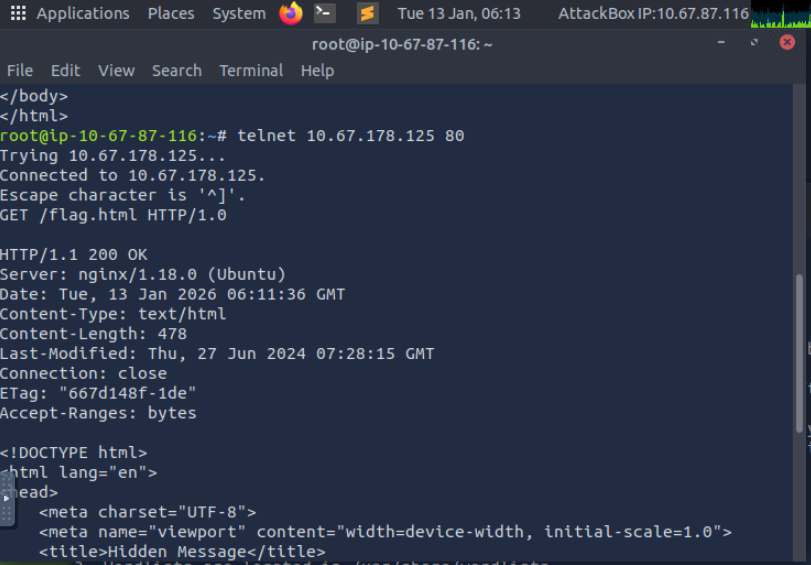
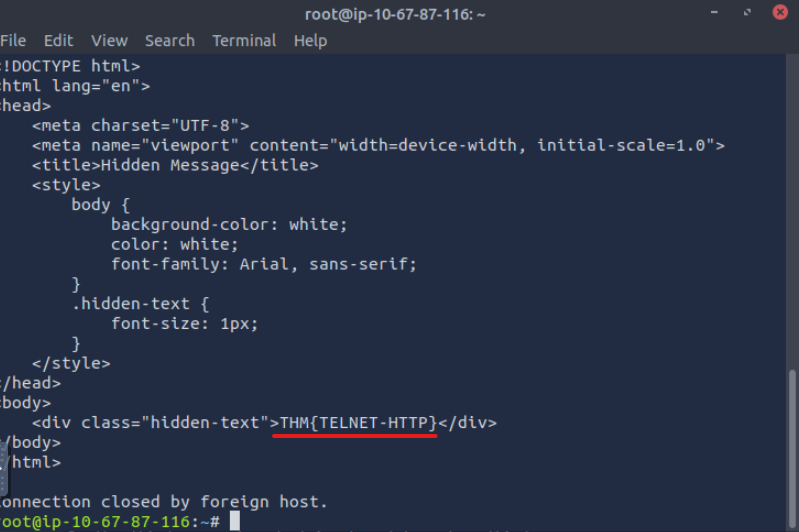
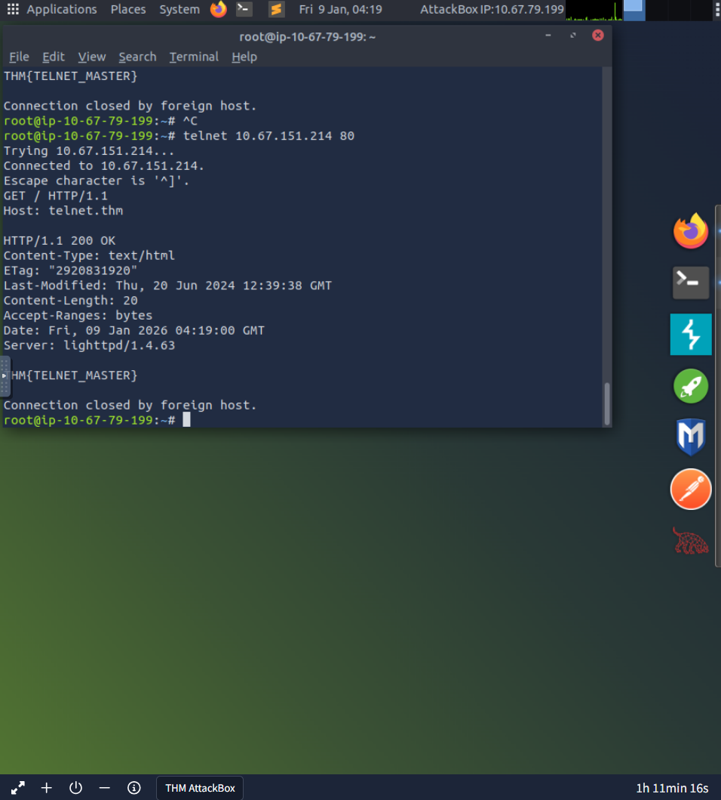

# Telnet HTTP Enumeration

Used telnet to manually interact with a web server over TCP port 80.

## What I did
- Connected to the server using telnet
- Sent a raw HTTP request (`GET / HTTP/1.0`)
- Identified the web server software and version
- Retrieved a flag from the HTTP response

## Retrieving a hidden web resource

Extended the same telnet technique to request a non-default file on the web server.

- Manually requested a specific resource using `GET /flag.html HTTP/1.0`
- Observed the full HTTP response, including headers and HTML body
- Identified hidden content that is not linked from the main page

## Key observations
- HTTP is a plaintext protocol, so a raw TCP client is enough to speak it
- Response headers disclose the server software and version
- Resources that are never linked from the site are still retrievable if the path is known

## Why this matters for SOC
Reading raw HTTP the way the server sees it makes header disclosure and unlinked content obvious, which is the same view an analyst needs when reconstructing web traffic from a packet capture or proxy log.

## Skills practiced
- TCP communication
- HTTP request and response formatting
- Manual service and web enumeration
- Identifying information exposure in server responses

## Screenshots

Raw HTTP response returned over the telnet connection, including server headers.

Flag found in the HTTP response body.

Flag retrieved from the manually requested resource.

