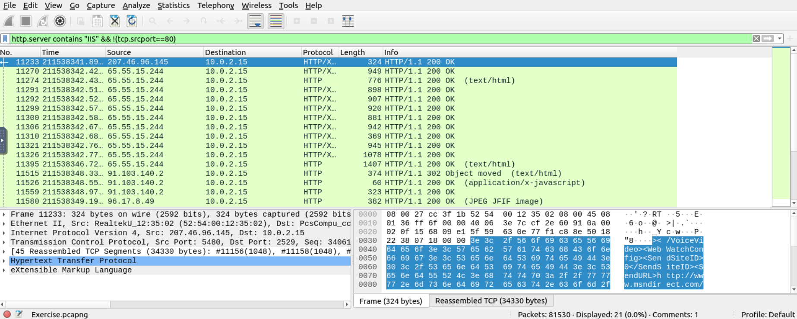
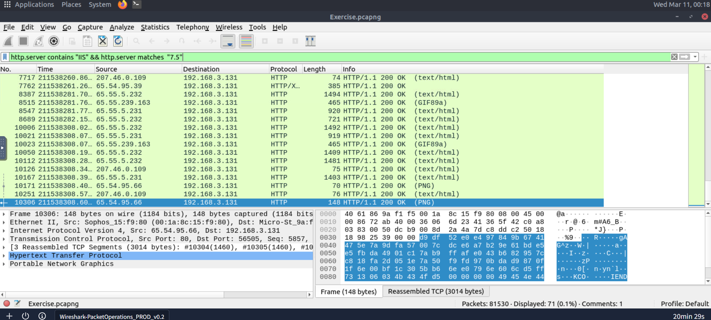
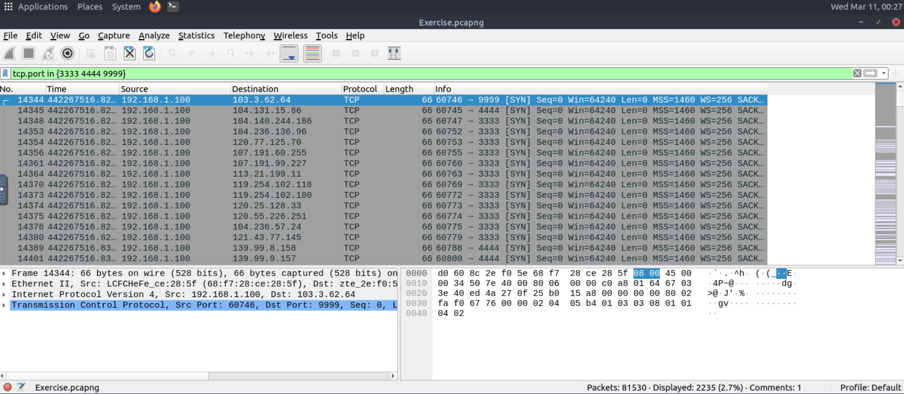
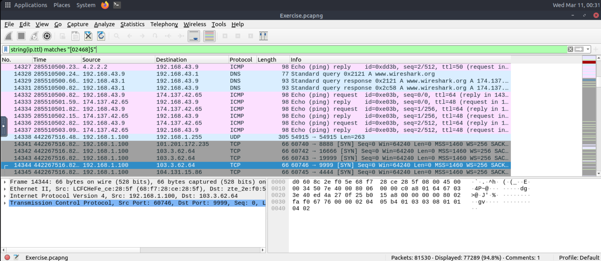
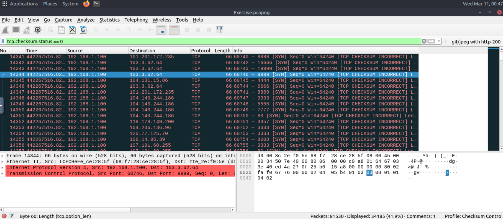

# Wireshark Advanced Filtering Analysis

## Lab Overview

This lab demonstrates advanced filtering techniques using Wireshark.

The objective was to analyze packet captures using operators such as:
- contains
- in
- mathematical filtering
- checksum analysis

Tool used:
- Wireshark

---

## Investigation 1: Microsoft IIS Servers

Filter used:

Purpose:

Identify HTTP packets where the web server is Microsoft IIS.

Screenshot:

---

## Investigation 2: Microsoft IIS Version 7.5

Filter used:

Purpose:

Identify HTTP packets where the web server is Microsoft IIS.

Screenshot:

---

Purpose:

Identify packets from IIS servers running version 7.5.

Screenshot:

---

## Investigation 3: Suspicious Port Usage

Filter used:

Purpose:

Detect packets using uncommon or potentially suspicious ports.

Screenshot:

---

## Investigation 4: Even TTL Packets

Filter used:

Purpose:

Analyze packets based on TTL values to demonstrate filtering using mathematical operators.

Screenshot:

---

## Investigation 5: Bad TCP Checksums

Filter used:

Purpose:

Detect packets with incorrect TCP checksums which may indicate corruption or network anomalies.

Screenshot:

---

## Skills Demonstrated

- Packet analysis
- Network protocol investigation
- Advanced Wireshark filtering
- Network anomaly detection
