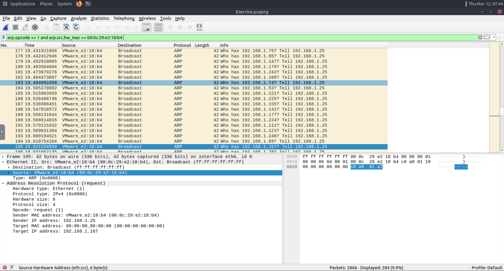
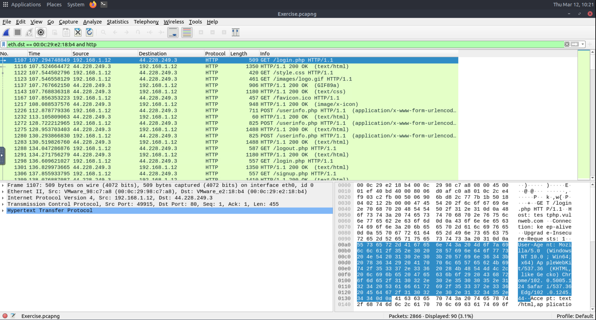
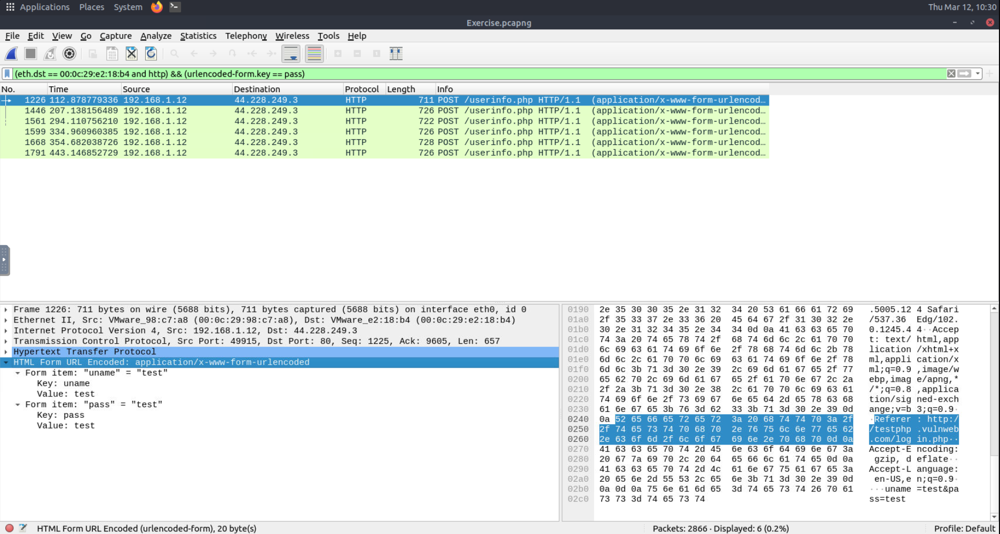
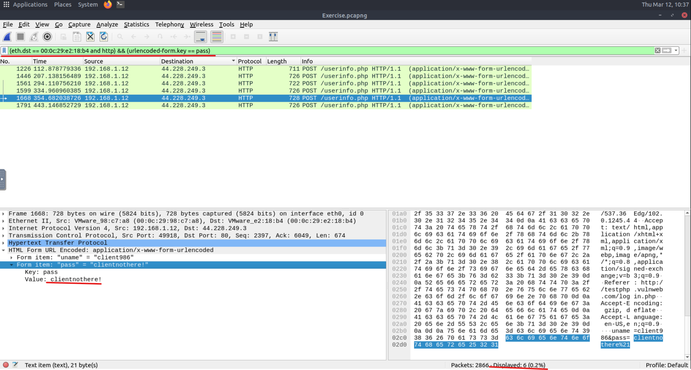

# ARP Poisoning / MITM Investigation

## Lab
TryHackMe - Wireshark ARP Poisoning Analysis

## Objective
Investigate a packet capture to detect an ARP poisoning attack and identify evidence of a Man-in-the-Middle (MITM) attack.

## Tools
Wireshark

---

## Investigation Process

### 1. Identify ARP anomalies

ARP traffic was inspected to identify devices sending abnormal ARP requests.

Filter used:

```
arp.src.hw_mac == 00:0c:29:e2:18:b4
```

This revealed a device sending a large number of ARP requests, indicating possible ARP spoofing activity.



---

### 2. Confirm Man-in-the-Middle behaviour

HTTP traffic was analysed to determine if traffic was being redirected through the attacker.

Filter used:

```
eth.dst == 00:0c:29:e2:18:b4 and http
```

HTTP packets were observed being forwarded to the attacker's MAC address.



---

### 3. Inspect intercepted HTTP traffic

HTTP POST requests were inspected to identify captured credentials.

Filter used:

```
http.request.method == "POST"
```



---

### 4. Extract compromised credentials

Inspection of HTTP POST data revealed login credentials belonging to Client986.

Password discovered:

clientnothere



---

## Findings

The investigation confirmed an ARP poisoning attack where the attacker impersonated the network gateway and redirected victim traffic through their device. This allowed interception of HTTP credentials from users on the network.

Key findings:

- Attacker MAC address: 00:0c:29:e2:18:b4
- ARP spoofing activity detected
- HTTP traffic redirected through attacker
- User credentials intercepted

---

## Skills Demonstrated

- Network packet analysis
- ARP spoofing detection
- Man-in-the-Middle traffic analysis
- HTTP credential inspection
