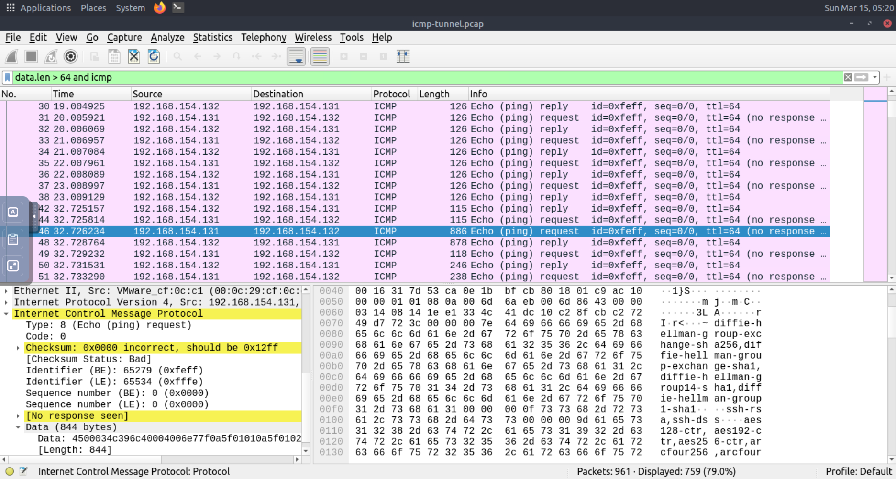
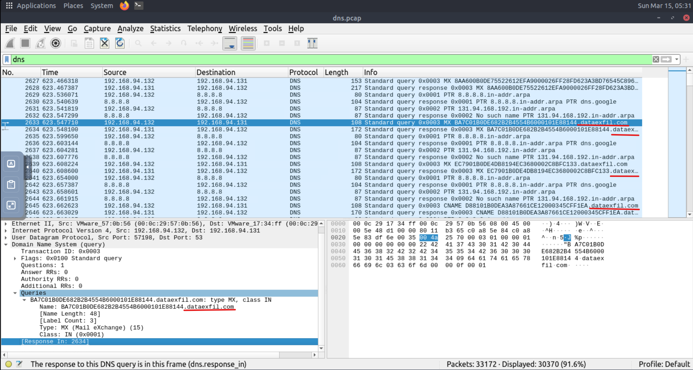

# DNS Tunnelling Detection

## Lab
TryHackMe - Wireshark DNS Analysis

## Objective
Investigate DNS traffic to detect possible command-and-control (C2) tunnelling activity.

## Tool
Wireshark

---

## Investigation

### 1. Identify abnormal DNS queries

Filter used:

dns.qry.name.len > 15 and !mdns

This reveals DNS queries with unusually long domain names.

These domains often contain encoded data used for command-and-control communication.

---

### 2. Inspect suspicious domain traffic

Inspection of DNS packets shows encoded subdomains being sent to a suspicious external domain.

---

## Findings

The traffic indicates possible DNS tunnelling behaviour where encoded data is transmitted through DNS queries.

This technique is commonly used by malware to communicate with command-and-control (C2) servers while bypassing security monitoring.

---

## Skills Demonstrated

- DNS traffic analysis
- Detection of abnormal query patterns
- Identification of potential C2 communication
