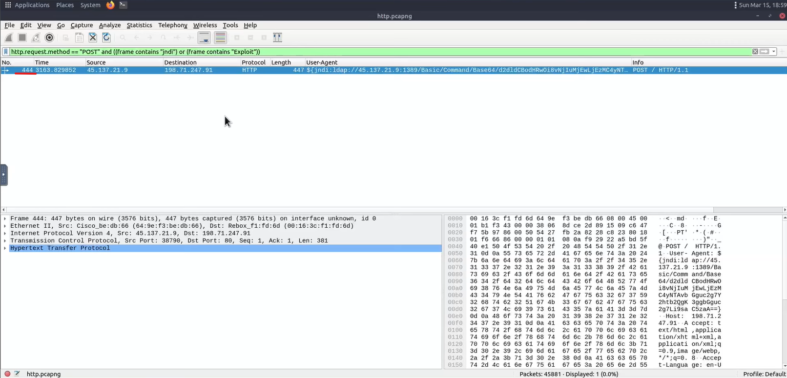
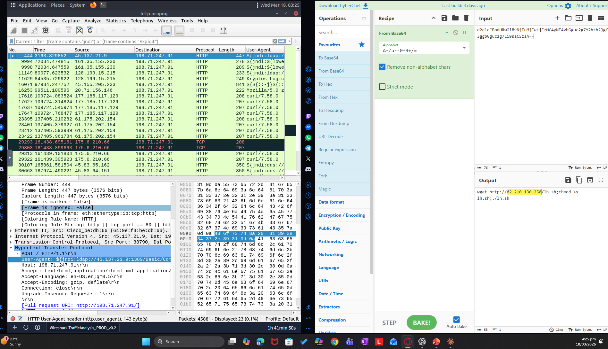

# Log4j Attack Detection (HTTP Analysis)

## Lab
TryHackMe - Wireshark HTTP Analysis

## Objective
Detect and investigate a Log4j exploitation attempt and identify the attacker’s IP address.

## Tool
Wireshark

---

## Investigation Process

### 1. Identify Log4j attack

Filter used:

http.request.method == "POST"

A suspicious POST request containing "jndi" was identified.

---

### 2. Decode attacker payload

The payload contained base64 encoded data which was decoded to reveal the attacker’s IP address.

---

## Findings

- Log4j exploit detected using JNDI payload
- Malicious POST request identified
- Base64 encoded data extracted and decoded
- Attacker IP address discovered

---

## Skills Demonstrated

- HTTP traffic analysis
- Log4j exploit detection
- Payload decoding (base64)
- Identifying attacker infrastructure
