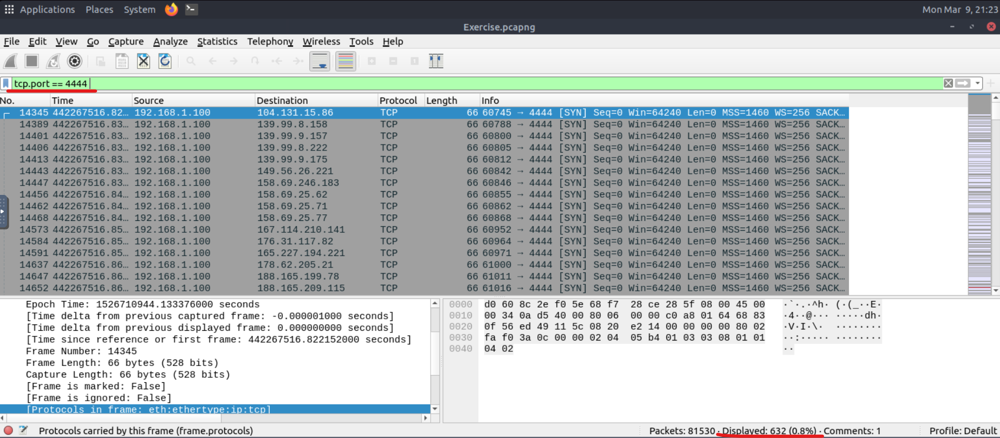
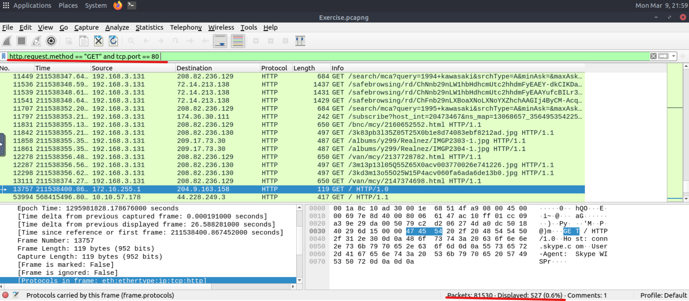
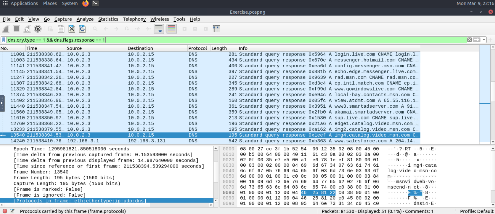

# Wireshark Protocol Filters Analysis

## Lab Overview

This lab demonstrates how protocol filters can be used in Wireshark to investigate packet captures.

The goal was to filter specific network activity such as TCP ports, HTTP requests, and DNS queries.

Tool used:
- Wireshark

---

## Investigation 1: TCP Port 4444 Traffic

Filter used:

```
tcp.port == 4444
```

Purpose:

Port 4444 is commonly used by backdoors or reverse shells. Filtering this port helps identify suspicious communications.

Screenshot:



---

## Investigation 2: HTTP GET Requests to Port 80

Filter used:

```
http.request.method == "GET" and tcp.port == 80
```

Purpose:

HTTP GET requests are used by clients to retrieve web resources from servers.

Screenshot:



---

## Investigation 3: DNS Type A Queries

Filter used:

```
dns.qry.type == 1
```

Purpose:

DNS A queries resolve domain names into IPv4 addresses. Analysts often review DNS traffic to identify suspicious domain lookups.

Screenshot:



---

## Skills Demonstrated

- Packet analysis
- Network protocol filtering
- Investigating HTTP traffic
- DNS query analysis
