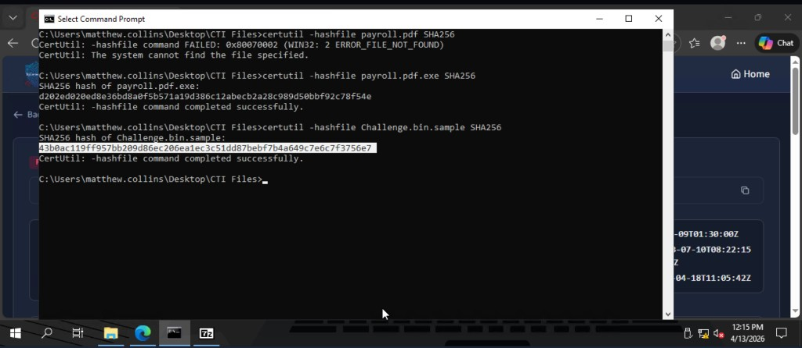
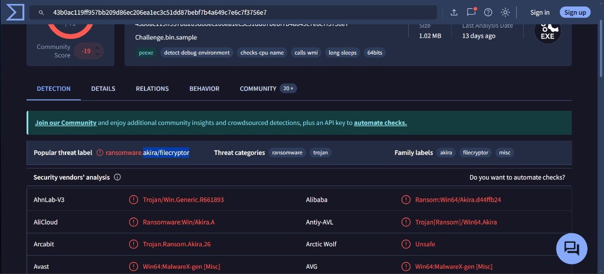
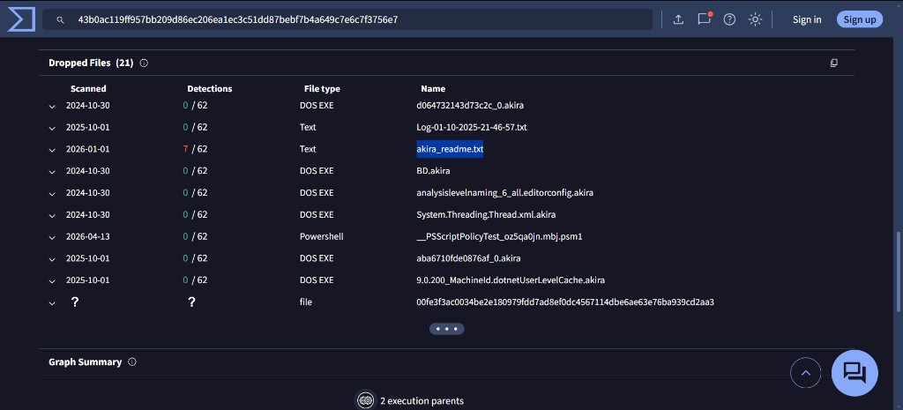
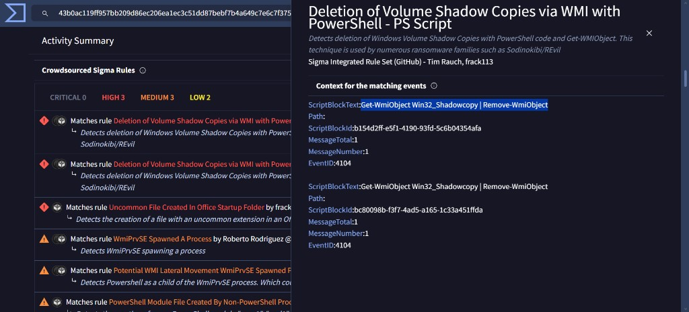

# Threat Intelligence Challenge - File and Hash Analysis

## Lab
TryHackMe - File and Hash Intelligence

## Objective
Independently investigate a suspicious file (Challenge.bin.sample) using real threat intelligence tools - generating a hash, analysing it on VirusTotal, reviewing sandbox behaviour, and mapping findings to MITRE ATT&CK.

## Tools Used
- PowerShell (hash generation)
- VirusTotal (malware family identification)
- TryDetectThis sandbox (behaviour analysis)
- MITRE ATT&CK Framework

---

## Investigation Process

### 1. Generate SHA256 hash

Used PowerShell to generate the SHA256 hash of the suspicious file to create a unique fingerprint for lookup.

---

### 2. Identify malware family on VirusTotal

Searched the hash on VirusTotal. Multiple vendors flagged the file and assigned malware family labels confirming it as malicious.

---

### 3. Identify dropped file during execution

Reviewed sandbox analysis results to find files created during execution. A text file was dropped to disk during the malware's runtime.

---

### 4. Identify PowerShell command and MITRE ATT&CK mapping

Found a PowerShell command executed by the malware during sandbox analysis. Mapped the behaviour to its corresponding MITRE ATT&CK technique ID.

---

## Findings
- File confirmed malicious via VirusTotal with multiple vendor detections and family labels
- Malware dropped a text file to disk during execution
- Malware executed a PowerShell command mapped to a specific MITRE ATT&CK technique
- Full investigation completed independently using real threat intelligence tools

---

## Skills Demonstrated
- SHA256 hash generation using PowerShell
- VirusTotal hash lookup and malware family identification
- Sandbox behaviour analysis
- Dropped file detection
- MITRE ATT&CK technique mapping
