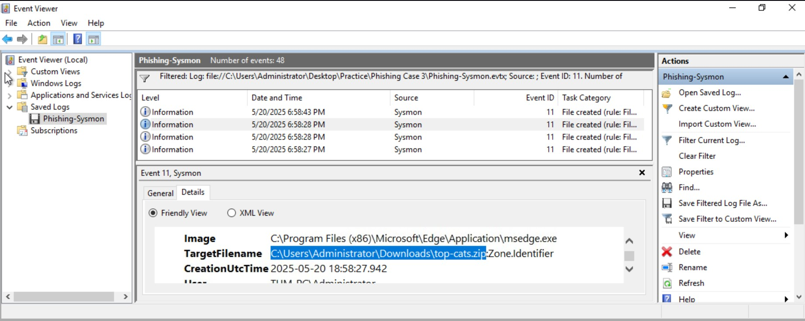
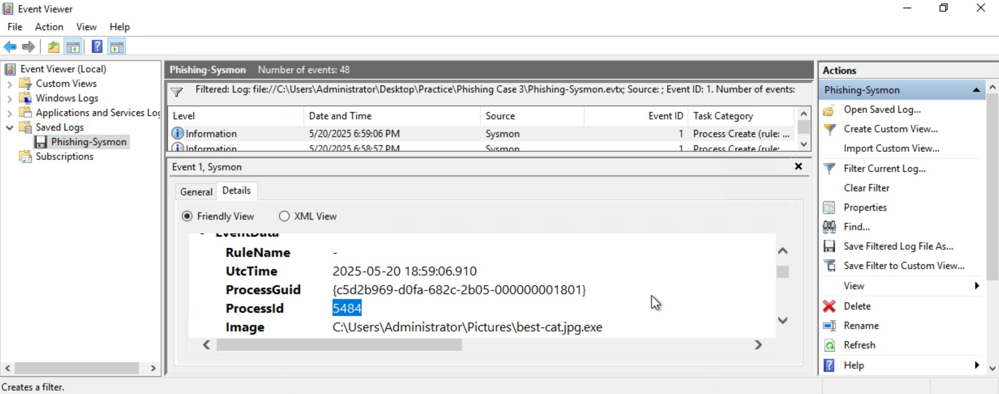

# Phishing Malware Detection via Sysmon

## Lab
TryHackMe - Windows Initial Access

## Objective
Investigate Sysmon logs to trace a phishing malware infection from initial download through to C2 communication.

## Tool
Windows Event Viewer (Sysmon logs)

---

## Investigation Process

### 1. Identify the malicious download
Event ID: 11
Filtered for file creation events where the Image was a web browser. Found the browser creating a suspicious archive in the Downloads folder.

### 2. Confirm malware execution
Event ID: 1
Filtered for process creation and found the extracted file executing with Explorer.exe as parent. Noted the ProcessId.

### 3. Trace C2 communication
Event ID: 3
Used the ProcessId from Step 2 to filter network connection events. Found the malware connecting to an external malicious domain.

---

## Findings
- User downloaded malicious archive via browser
- Double-extension file extracted and executed
- Malware established outbound C2 connection
- Full chain traced using ProcessId as pivot point

---

## Skills Demonstrated
- Sysmon log analysis
- ProcessId pivoting across multiple event types
- Malware download and execution detection
- C2 communication identification

## Screenshots Needed
- malware-downloaded.png — Event ID 11 showing browser downloading file
- malware-executed.png — Event ID 1 showing malware running with ProcessId visible
- c2-connection.png — Event ID 3 showing same ProcessId connecting to malicious domain
