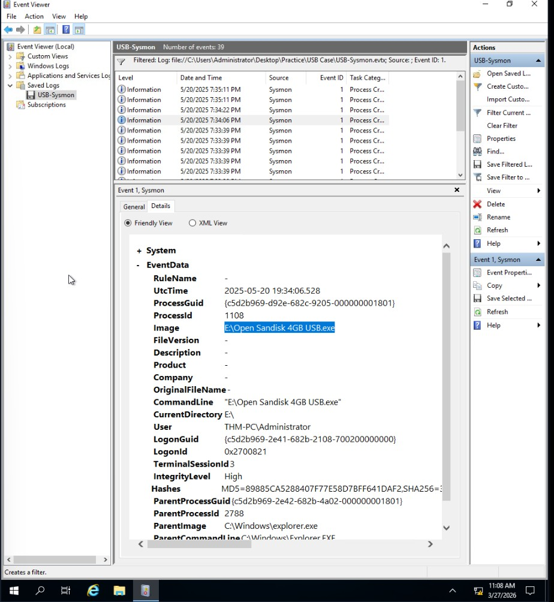
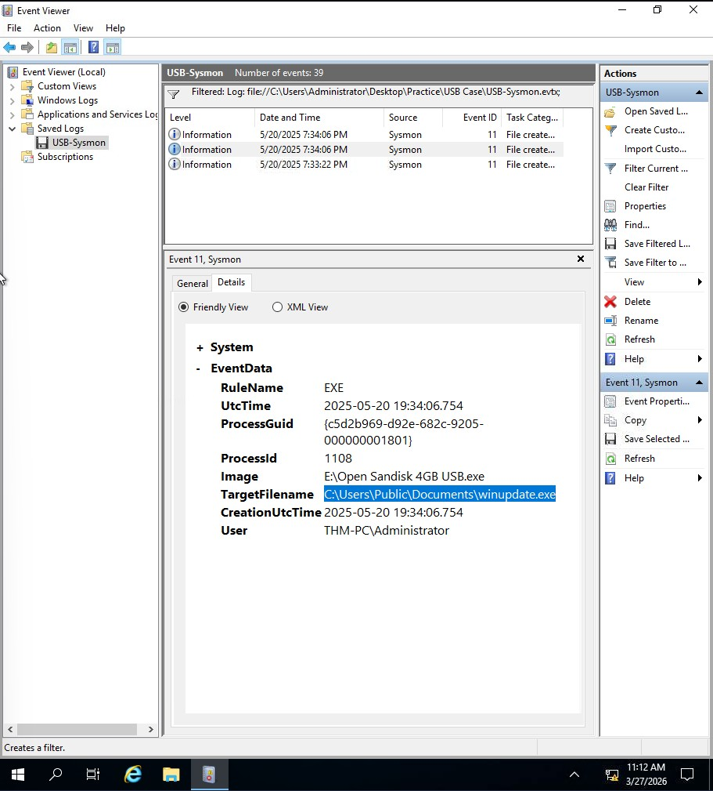
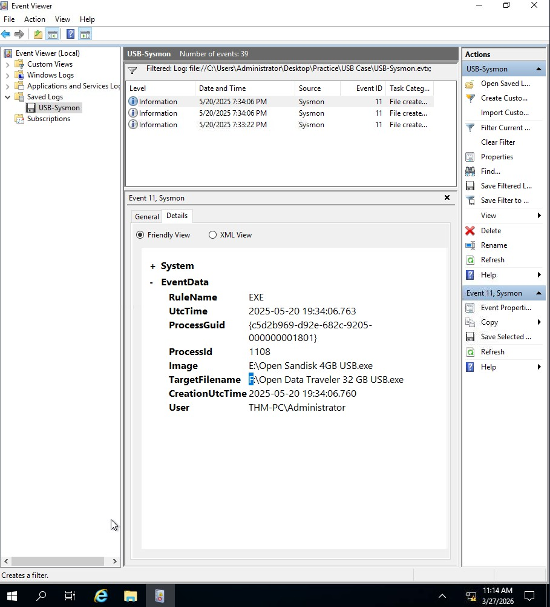

# USB Malware Detection via Sysmon

## Lab
TryHackMe - Windows Initial Access

## Objective
Investigate Sysmon logs to detect malware execution from a USB drive, identify dropped files, and confirm propagation to other USB devices.

## Tool
Windows Event Viewer (Sysmon logs)

---

## Investigation Process

### 1. Identify execution from USB
Event ID: 1
Filtered for process creation events. Found a process where the Image path started with a non-C: drive letter, confirming execution from an external USB drive.

### 2. Find the dropped file
Event ID: 11
Used the ProcessId from Step 1 to filter file creation events. Found the malware dropping an executable to a local staging directory.

### 3. Confirm USB propagation
Event ID: 11
Continued reviewing Event ID 11 events for the same ProcessId. Found a file created on a second drive letter confirming spread to another USB.

---

## Findings
- Malware executed directly from USB (non-C: drive letter)
- Malware dropped persistent copy to local staging directory
- Malware propagated to a second USB drive
- Full chain traced using ProcessId pivoting

---

## Skills Demonstrated
- Sysmon log analysis
- USB-based malware execution detection
- ProcessId pivoting across Event ID 1 and 11
- Malware propagation tracking
