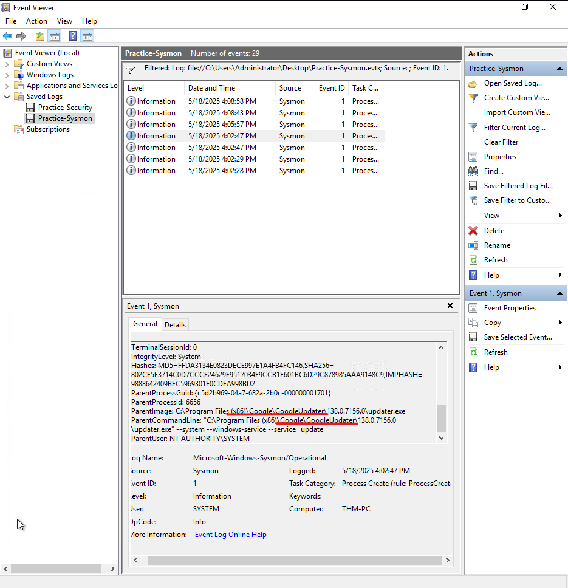
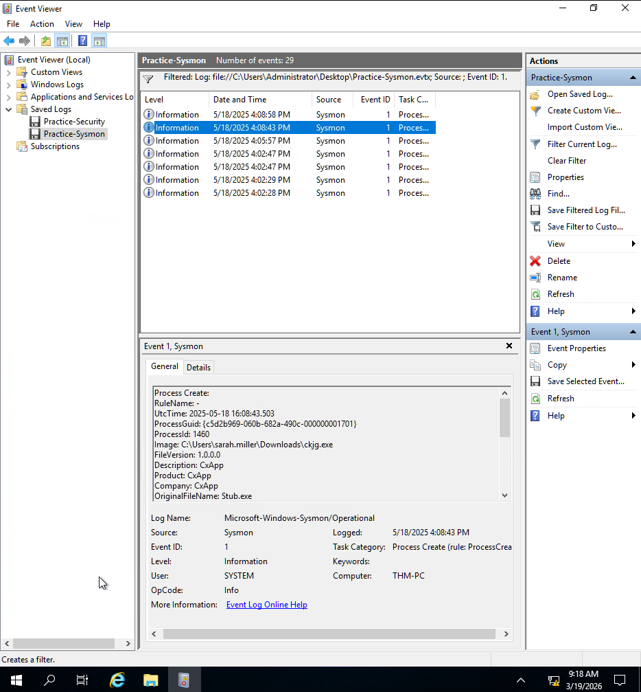
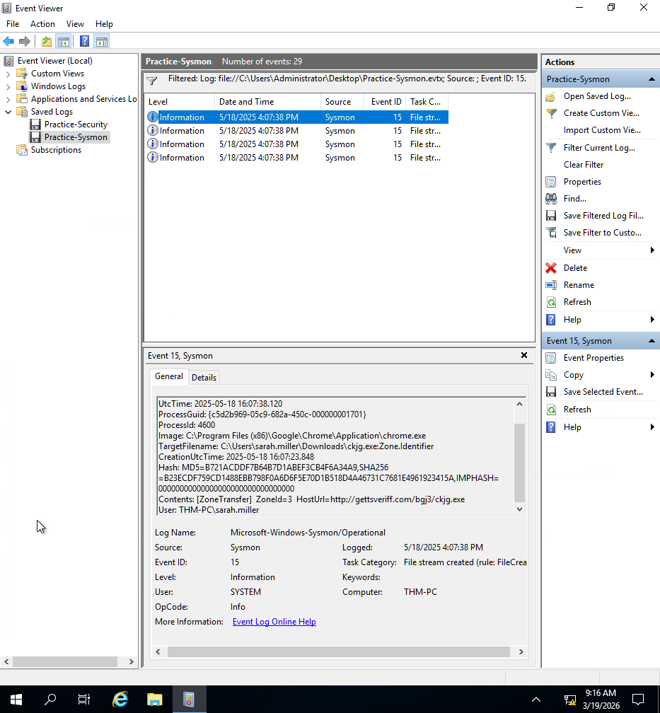

# Process Analysis with Sysmon

## Lab
TryHackMe - Windows Logging for SOC

## Objective
Identify how a user system was compromised by analysing process creation and network activity.

## Tool
Event Viewer (Sysmon Logs)

---

## Investigation Process

### 1. Identify browser activity

Sysmon Event ID:

1

The user’s web browser process was identified.

---

### 2. Detect downloaded file

Sysmon Event ID:

1

A suspicious file downloaded from the browser was identified via process execution.

---

### 3. Identify download source

Sysmon Event ID:

15

Network logs revealed the URL used to download the file.

---

## Findings

- User browsed the web using a specific browser
- A file was downloaded and executed
- The download source URL was identified
- Indicates potential initial access via malicious download

---

## Skills Demonstrated

- Process monitoring with Sysmon
- Identifying downloaded malware
- Tracing activity from browser → file → network
- Investigating initial access techniques
