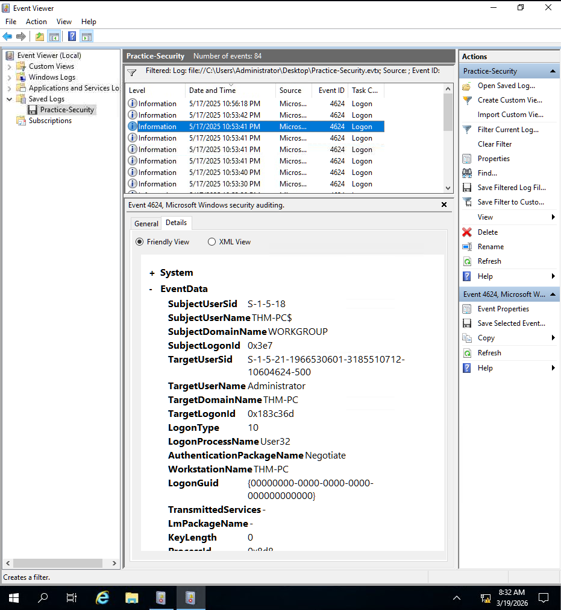
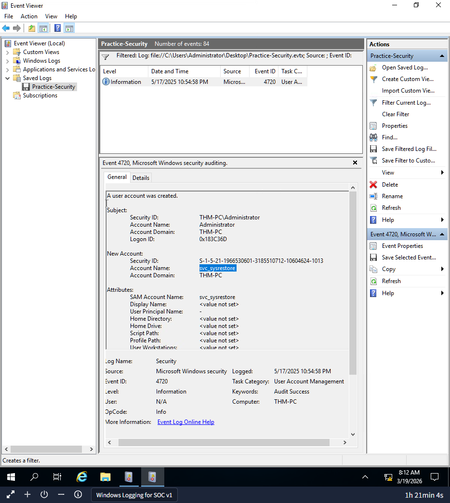
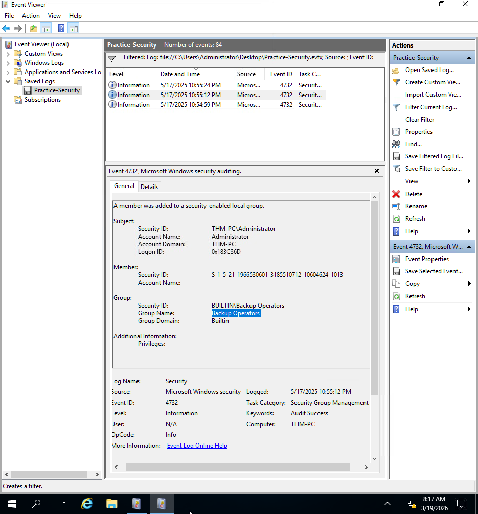
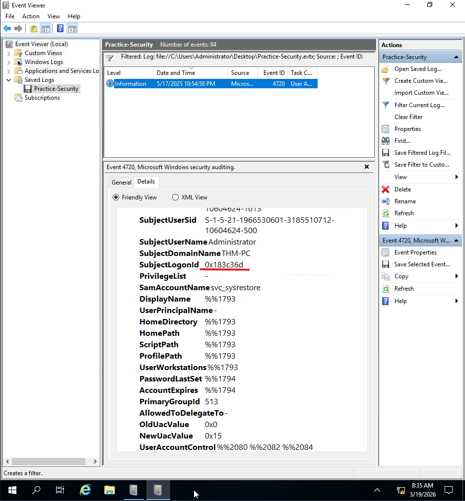

# Windows User Backdoor Detection

## Lab
TryHackMe - Windows Logging for SOC

## Objective
Identify unauthorized user creation and privilege escalation using Windows event logs.

## Tool
Event Viewer

---

## Investigation Process

### 1. Identify RDP login

Event ID:

4624

A successful login event was identified as the starting point.

---

### 2. Detect user creation

Event ID:

4720

A new user account was created shortly after the login.

---

### 3. Detect privilege escalation

Event ID:

4732

The new account was added to privileged groups.

---

### 4. Correlate events using Logon ID

The Logon ID from the login event matches the Logon ID in the account creation event.

---

## Findings

- Attacker logged in via RDP
- Created a backdoor user account
- Added the account to privileged groups
- Activity confirmed using Logon ID correlation

---

## Skills Demonstrated

- Windows event log analysis
- Detecting unauthorized account creation
- Identifying privilege escalation
- Correlating events using Logon ID
