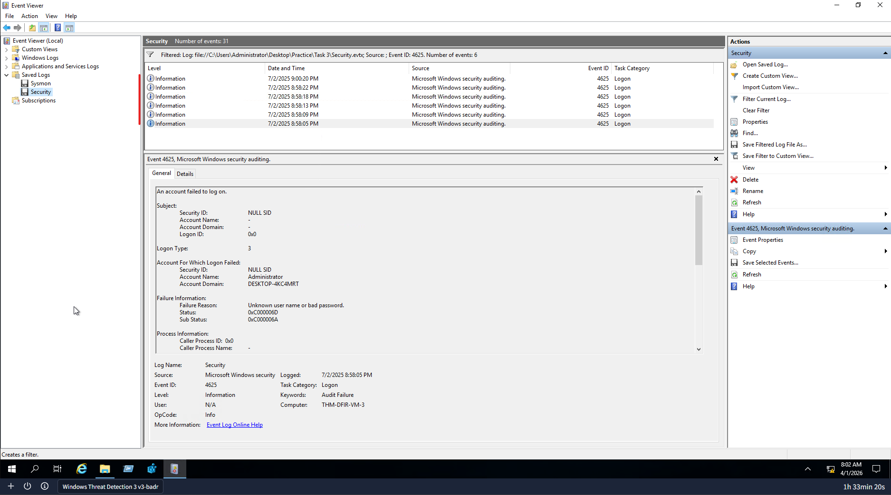
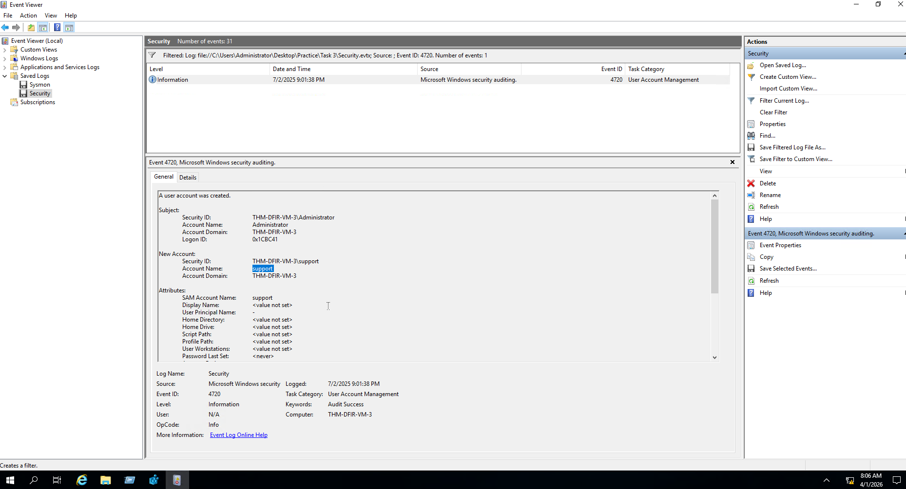
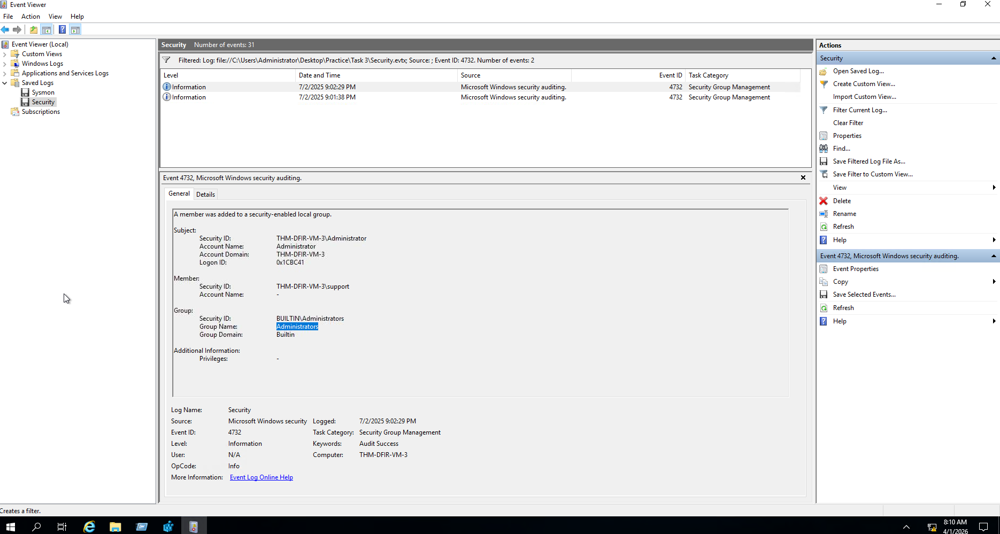

# Backdoor User Account Detection

## Lab
TryHackMe - Windows Threat Detection 3

## Objective
Investigate Windows Security logs to detect a backdoor user account created by an attacker after an RDP brute force, and identify the privilege escalation that followed.

## Tool
Windows Event Viewer (Security logs)

---

## Investigation Process

### 1. Detect the RDP brute force

Event ID: 4625

Filtered Security logs for failed logon events. Found a burst of failed logons against the `Administrator` account over Logon Type 3 within roughly a minute, with failure reason "Unknown user name or bad password" - the signature of a password guessing attack.

---

### 2. Detect the backdoor user created

Event ID: 4720

Filtered Security logs for user creation events. Found a new local account named `support` created shortly after the attacker's successful login - a deliberately unremarkable name chosen to blend in with legitimate accounts.

---

### 3. Detect privilege escalation

Event ID: 4732

Filtered for group membership events. Found the `support` account being added to the built-in `Administrators` group, giving the attacker full administrative access to the machine.

---

## Findings
- Attacker brute forced RDP before gaining access
- Backdoor account `support` created shortly after the successful login
- Backdoor account added to the local `Administrators` group for full admin access
- Attack chain confirmed by correlating Security events on the same host and Logon ID

## Skills Demonstrated
- Windows Security log analysis
- Brute force detection via Event ID 4625
- Backdoor account detection via Event ID 4720
- Privilege escalation detection via Event ID 4732
