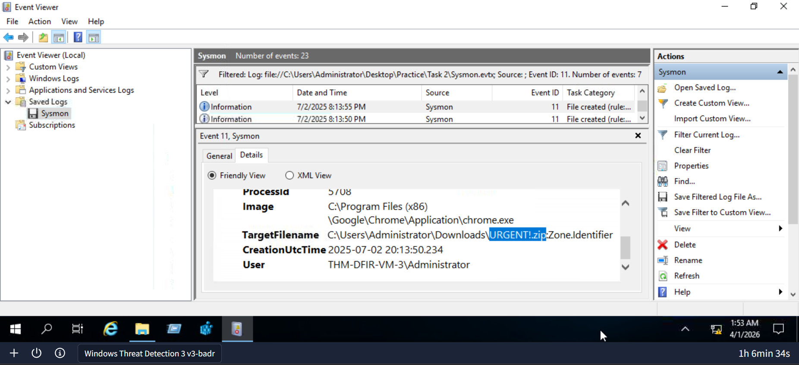
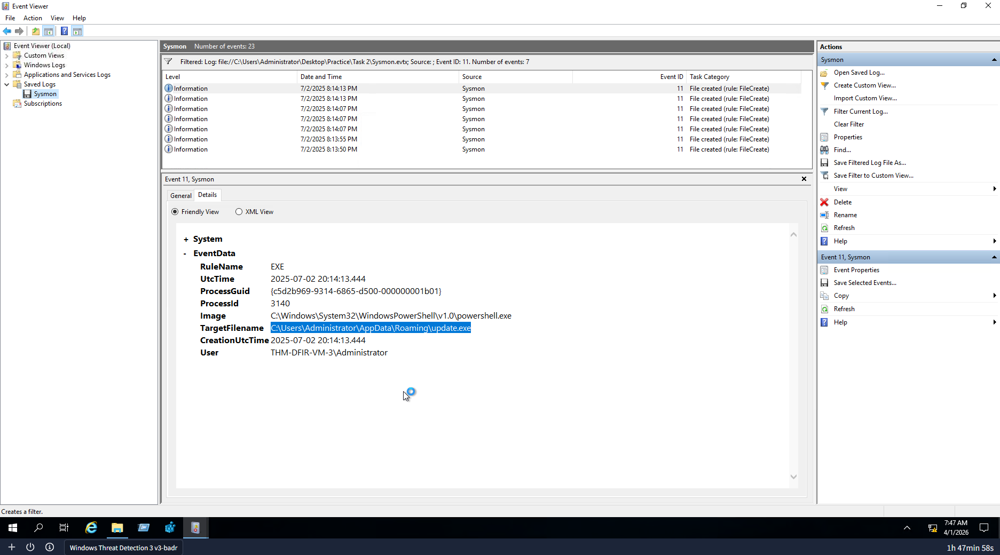
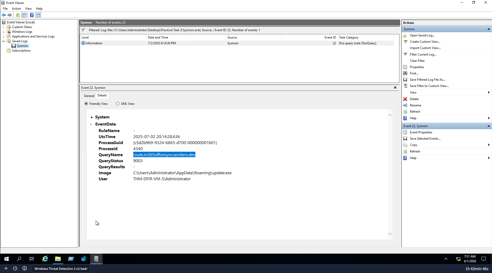

# Command and Control (C2) Detection

## Lab
TryHackMe - Windows Threat Detection 3

## Objective
Investigate Sysmon logs to detect a C2 setup — finding the suspicious archive downloaded, the hidden malware file, and the C2 server domain.

## Tool
Windows Event Viewer (Sysmon logs)

---

## Investigation Process

### 1. Identify the suspicious archive downloaded

Event ID: 11

Filtered Sysmon for file creation events. Found a suspicious archive file appearing in the Downloads folder — this was the initial phishing attachment that triggered the C2 setup.

---

### 2. Find where the C2 malware was hidden

Event ID: 11

Continued reviewing file creation events. Found the malware dropping a second hidden file into a staging directory. Attackers do this so the C2 connection survives even if the original attachment gets deleted.

---

### 3. Identify the C2 server domain

Event ID: 22

Filtered Sysmon for DNS query events from the malware process. Found the domain the malware was connecting to — this is the attacker's Command and Control server.

---

## Findings
- Suspicious archive downloaded via phishing
- C2 malware hidden in staging directory to survive deletion of original file
- Malware established connection to external C2 server domain
- Full C2 setup traced using Event ID 11 and Event ID 22

---

## Skills Demonstrated
- Sysmon log analysis
- C2 detection via DNS query events
- Hidden malware file identification
- Event ID 11 and Event ID 22 correlation
