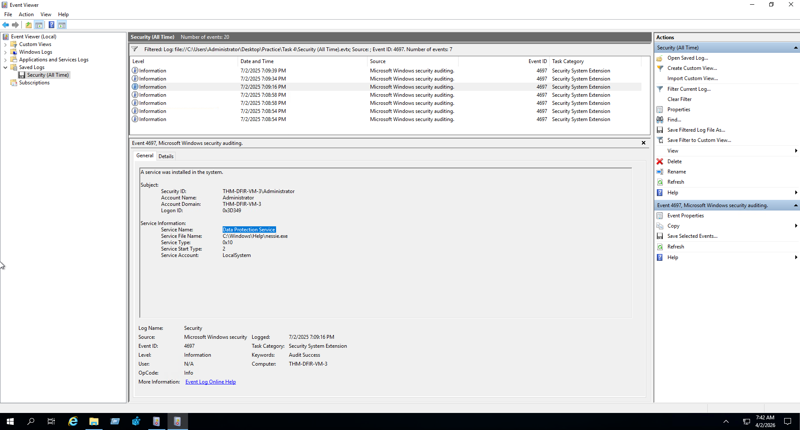
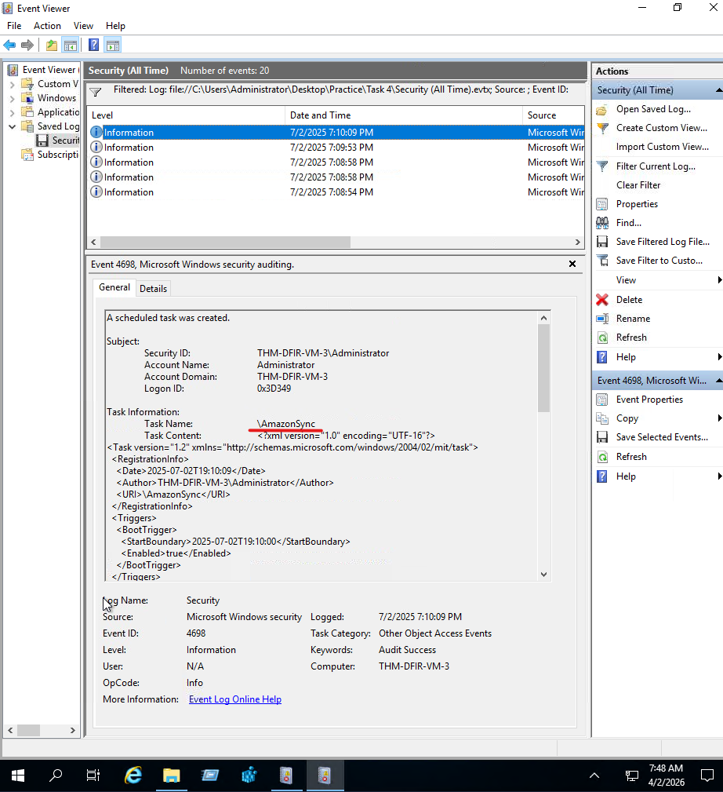

# Malicious Service and Scheduled Task Detection

## Lab
TryHackMe - Windows Threat Detection 3

## Objective
Investigate Security logs to detect malware persistence via a malicious Windows service and a malicious scheduled task.

## Tool
Windows Event Viewer (Security logs)

---

## Investigation Process

### 1. Detect malicious Windows service

Event ID: 4697

Filtered Security logs for service creation events. Found a service named "Data Protection Service" installed with a service file name of `C:\Windows\Help\nessie.exe`, running as `LocalSystem` with a start type of 2 (automatic). The legitimate sounding display name hides a binary planted in the Help directory, which is not where services normally live.

---

### 2. Detect malicious scheduled task

Event ID: 4698

Filtered Security logs for scheduled task creation events. Found a task registered as `\AmazonSync` with a `BootTrigger`, so the Troy malware re-launches on every system boot. As with the service, the name is chosen to look like ordinary vendor software.

---

## Findings
- Malicious service "Data Protection Service" created to run `C:\Windows\Help\nessie.exe` as LocalSystem on boot
- Malicious scheduled task `\AmazonSync` created with a boot trigger to run the Troy malware
- Both persistence methods survive system reboots
- Detected via Security Event ID 4697 and 4698

---

## Skills Demonstrated
- Windows Security log analysis
- Malicious service detection via Event ID 4697
- Malicious scheduled task detection via Event ID 4698
- Persistence mechanism identification
