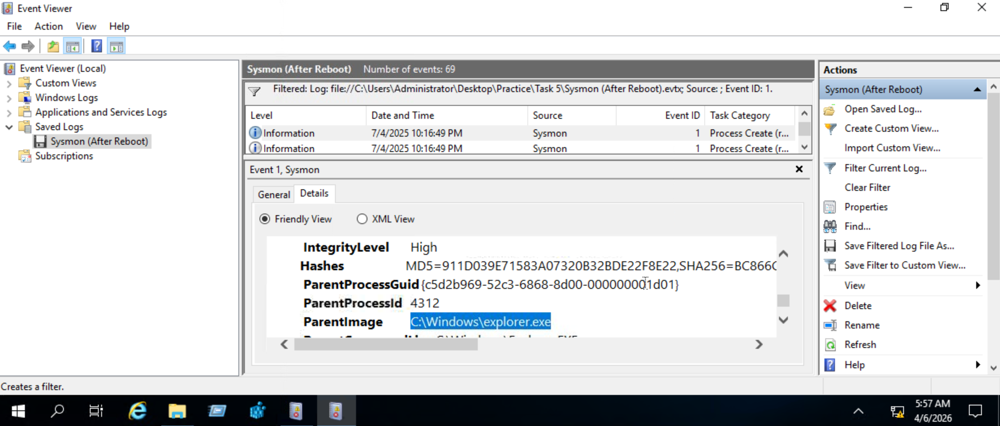
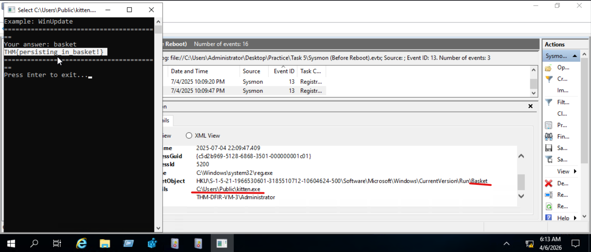

# Startup Folder and Run Key Persistence Detection

## Lab
TryHackMe - Windows Threat Detection 3

## Objective
Investigate Sysmon logs to detect malware persistence via the Windows startup folder and registry Run keys.

## Tool
Windows Event Viewer (Sysmon logs)

---

## Investigation Process

### 1. Confirm startup folder persistence

Event ID: 1

Reviewed the Sysmon log captured after a reboot and filtered for process creation. Found the Odin malware running with `C:\Windows\explorer.exe` as its ParentImage, which is how anything placed in the Startup folder gets launched. The parent process is the tell: a normal application is not spawned by Explorer at logon unless something put it there.

---

### 2. Detect Run key persistence

Event ID: 13

Filtered Sysmon for registry value change events. Found `reg.exe` writing a new value named `Basket` under `HKU\...\Software\Microsoft\Windows\CurrentVersion\Run` pointing at `C:\Users\Public\kitten.exe` - meaning the Kitten malware would run automatically on every user login.

---

## Findings
- Odin malware placed in the startup folder, confirmed running with explorer.exe as its parent after reboot
- Kitten malware added to registry Run key for automatic execution on login
- Both methods only require normal user permissions - no admin needed
- Detected via Sysmon Event ID 1 and Event ID 13

---

## Skills Demonstrated
- Sysmon log analysis
- Startup folder persistence detection via Event ID 1 parent process analysis
- Registry Run key persistence detection via Event ID 13
- Low privilege persistence technique identification
