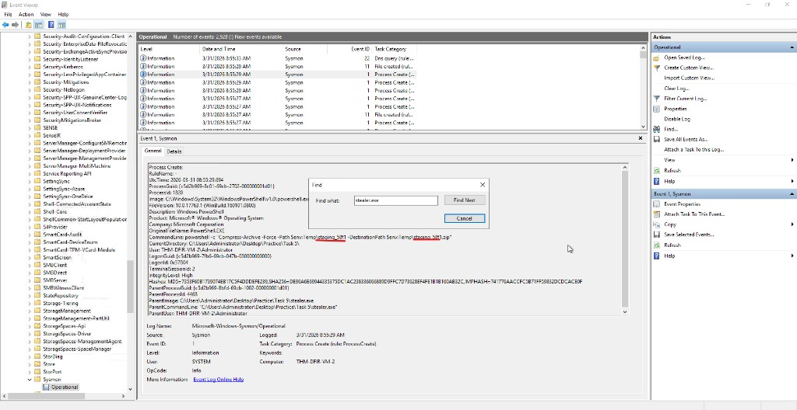
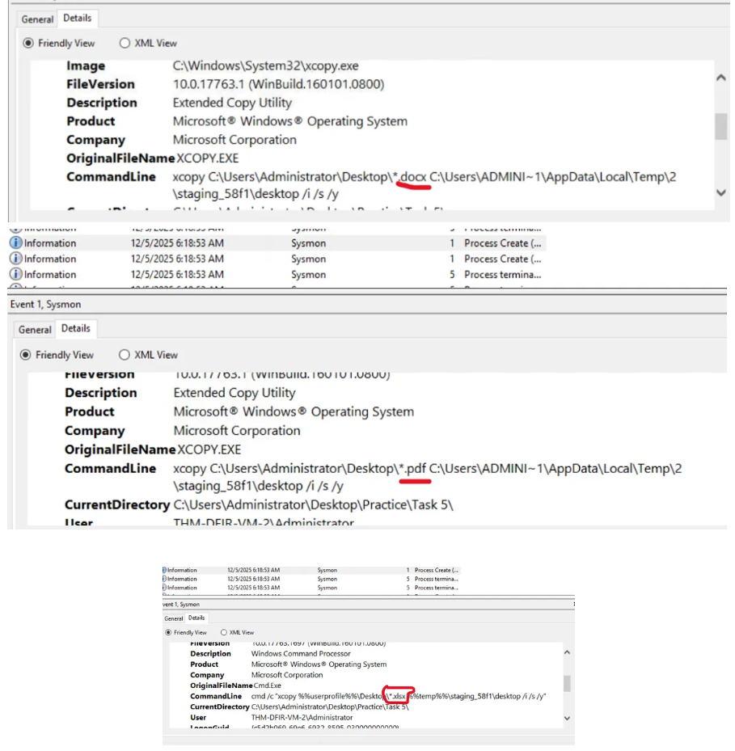
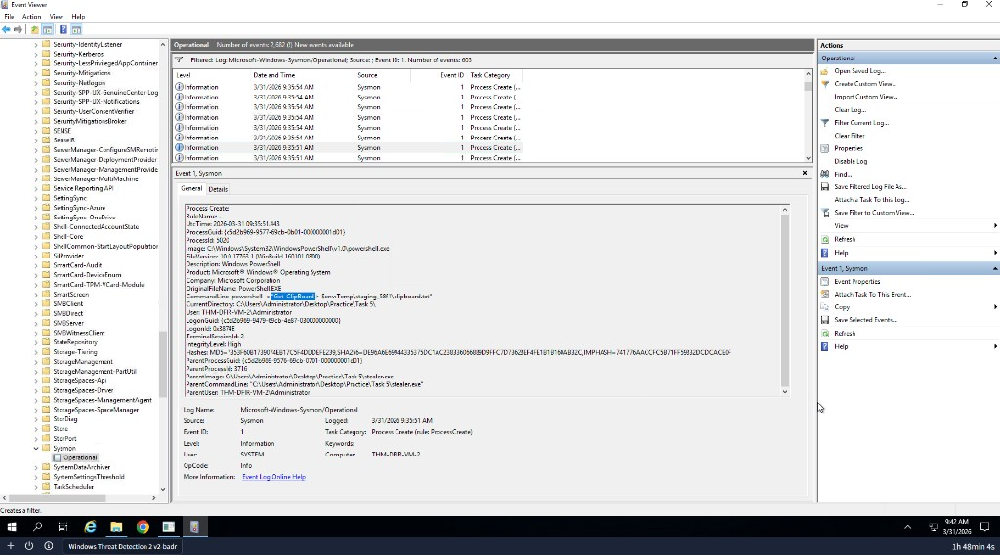
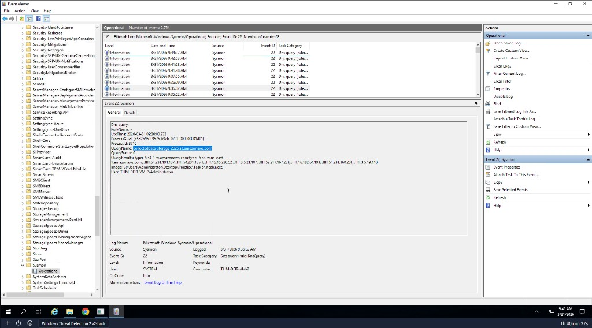

# Detecting Data Stealer via Sysmon

## Lab
TryHackMe - Windows Threat Detection

## Objective
Run a data stealer sample and investigate Sysmon logs to trace its collection and exfiltration activity.

## Tool
Windows Event Viewer (Sysmon logs)

---

## Investigation Process

### 1. Identify directory created by stealer

Event ID: 1

Filtered Sysmon Event ID 1 for processes launched by stealer.exe. Found the command used to create a new directory where the stealer dumped stolen files.

---

### 2. Identify file types targeted

Event ID: 1

Found PowerShell commands launched by stealer.exe that searched the computer for specific file extensions. This revealed what type of data the stealer was targeting.

---

### 3. Identify clipboard theft

Event ID: 1

Found a PowerShell cmdlet launched by the stealer specifically designed to read the clipboard - the temporary storage holding whatever the user last copied with Ctrl+C.

---

### 4. Identify exfiltration domain

Event ID: 22

Filtered Sysmon for DNS query events from stealer.exe. Found the domain the stealer sent all stolen data to. Event ID 22 was used because it shows the actual domain name rather than just an IP address.

---

## Findings
- Stealer created a staging directory to collect stolen files
- Stealer targeted specific file extensions automatically
- Stealer grabbed clipboard content using Get-Clipboard
- Stolen data was exfiltrated to a remote domain via DNS query

---

## Skills Demonstrated
- Sysmon log analysis
- Data stealer behaviour detection
- ProcessId pivoting across Event ID 1 and Event ID 22
- DNS exfiltration identification
