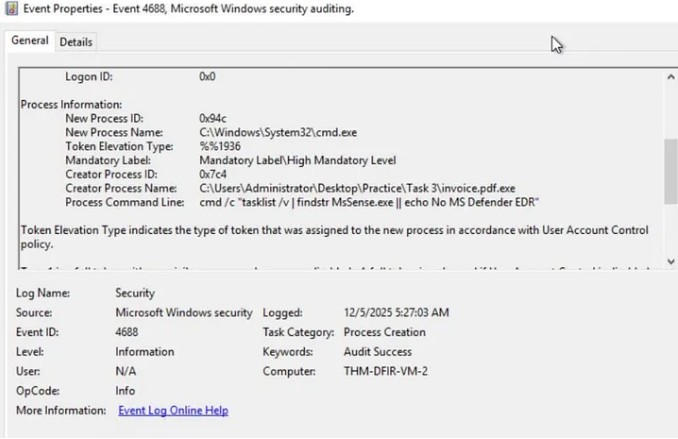
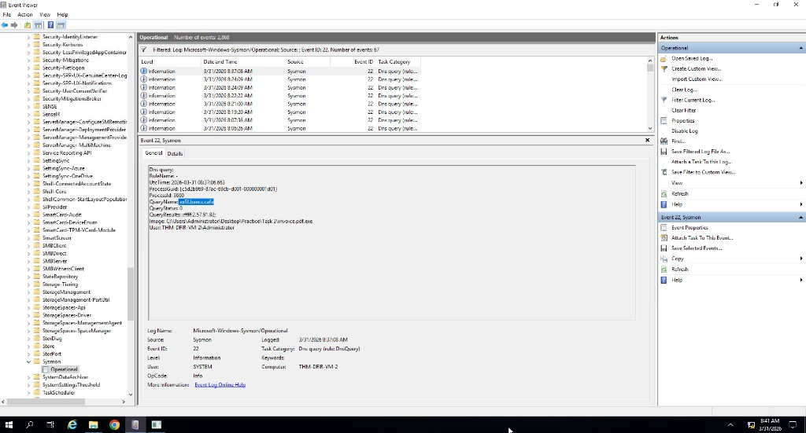

# Detecting Discovery Commands via Sysmon

## Lab
TryHackMe - Windows Threat Detection

## Objective
Investigate Sysmon logs to detect attacker discovery activity after initial access, trace commands back to the malware using process tree analysis, and identify the exfiltration domain.

## Tool
Windows Event Viewer (Sysmon logs)

---

## Investigation Process

### 1. Identify the first discovery command

Event ID: 1

Filtered Sysmon logs for Event ID 1 (process creation). Searched for events where ParentImage showed invoice.pdf.exe. The first child process it launched revealed the attacker's first action after getting in.

---

### 2. Detect antivirus check

Event ID: 1

Found a PowerShell command in the process tree launched by invoice.pdf.exe that checked whether Microsoft Defender was running. Attackers do this to decide whether it is safe to continue the attack.

---

### 3. Identify exfiltration domain

Event ID: 3

Filtered Sysmon for network connection events from invoice.pdf.exe and its child processes. Found the domain the malware sent the discovered data to.

---

## Findings
- Malware immediately ran whoami as the first discovery command after execution
- Malware checked Microsoft Defender status before continuing the attack
- Discovered data was exfiltrated to a malicious domain
- Full process tree traced using ParentImage and ParentProcessId

---

## Skills Demonstrated
- Sysmon process tree analysis
- Discovery command detection
- ParentImage and ParentProcessId correlation
- Malware behaviour tracing via Event ID 1 and Event ID 3
